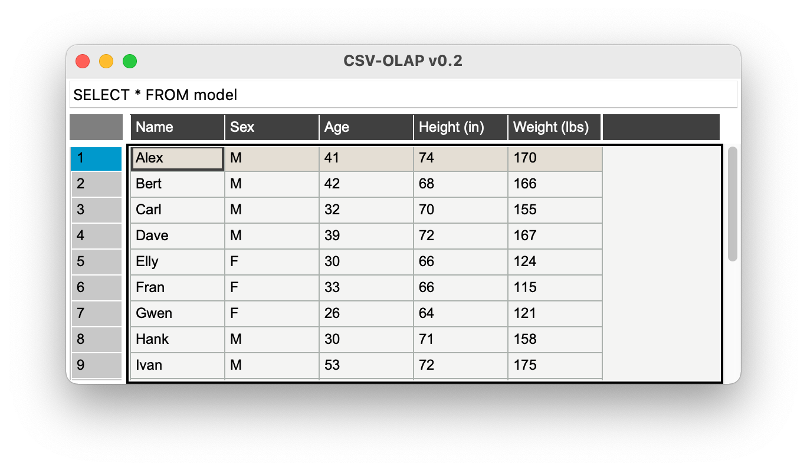

# CSV-OLAP
OLAP tool for CSV files.

## Introduction

Have you ever had a CSV file, opened with your favourite spreadsheet application, and you desired being able to work with it like in a database? Well, I did, and usually ended up by loading the file with RStudio or Jupyter+Python. But I always wanted a more simple way to work with it. That's the reason I created this super simple python script.

## Installation

Prerequisites: Python 3 and pip.

You need the following packages.

Pandas Table:

```bash
pip3 install pandastable
```

TKinter Table:

```bash
pip3 install tkintertable
```

Pandas SQL:

```bash
pip3 install pandasql
```

## Usage

To run CSV-OLAP just write:

```bash
python3 csvolap.py path/to/file.csv
```

You can also specify the query language you want to use, SQL or PANDAS:

```bash
python3 csvolap.py path/to/file.csv -l pandas
```

Default is SQL.



## Queries

To run a query, write in the text field at the top of the window and press enter.

For the SQL language, the syntax is the same of SQLite. The table name is "model". For example, if our CSV has a field named "Age" and we want to select only the rows where age is greater or equal than 35:

```sql
SELECT * FROM model WHERE "Age" >= 35
```

The other query language is PANDAS. It has the same syntax used in Python when working with pandas data frames. The DataFrame name is "model", and the pandas object is "pd". Following the "Age" example, in pandas we would do:

```python
model[model["Age"] >= 35]
```
